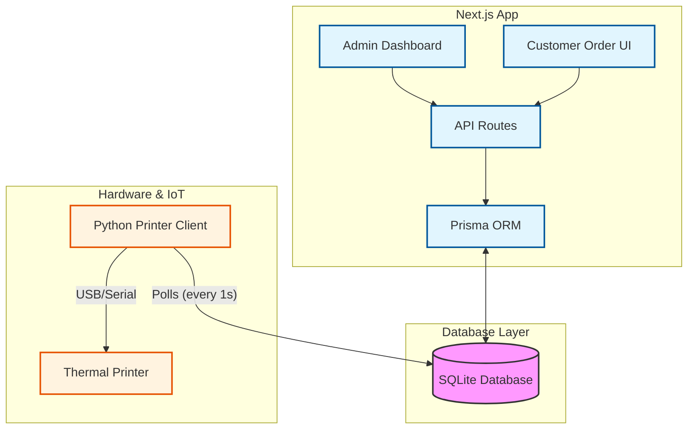

# Mobile Order App (モバイルオーダーアプリ)

Next.js を使用した飲食店向けモバイルオーダーアプリケーションです。
お客様が自身のスマートフォンから注文を行い、管理者が注文状況を管理できるシステムです。

## 技術スタック

- **Framework**: [Next.js](https://nextjs.org/) (App Router)
- **Language**: [TypeScript](https://www.typescriptlang.org/)
- **Database**: [SQLite](https://sqlite.org/) (via [Prisma](https://www.prisma.io/))
- **Styling**: [Tailwind CSS](https://tailwindcss.com/)
- **Runtime**: [Bun](https://bun.sh/)
- **Image Optimization**: [Sharp](https://sharp.pixelplumbing.com/)

## システム構成図



## プロジェクト構成

```
.
├── app/                  # Next.js App Router ソースコード
│   ├── admin/            # 管理者向けページ (商品管理、注文履歴など)
│   ├── api/              # API ルート
│   └── table/[id]/       # ユーザー向け注文ページ (テーブルごとの動的ルート)
├── prisma/               # データベース関連
│   ├── schema.prisma     # データベーススキーマ定義
│   └── seed.ts           # 初期データ投入スクリプト
├── public/               # 静的ファイル (画像など)
├── lib/                  # ユーティリティ関数
├── printer_client.py     # レシート印刷用 Python クライアント
└── server.ts             # カスタムサーバー設定 (Bun用)
```

## データベース構造 (テーブル)

アプリケーションは以下のテーブル構造を持っています。

### Product (商品)

メニューに表示される商品情報を管理します。

| カラム名 | 型 | 説明 |
| --- | --- | --- |
| `id` | Int | 主キー (自動採番) |
| `name` | String | 商品名 |
| `price` | Int | 価格 |
| `imageUrl` | String? | 商品画像URL |
| `category` | String | カテゴリ (例: "Food", "Drink", "Dessert") |
| `calories` | Int? | カロリー (kcal) |
| `alcoholContent` | Float? | アルコール度数 (%) |
| `isSoldOut` | Boolean | 売り切れフラグ (デフォルト: false) |
| `createdAt` | DateTime | 作成日時 |
| `updatedAt` | DateTime | 更新日時 |
| `unit` | String | 単位 (例: "点", "g", "ml") |
| `quantityStep` | Int | 注文数量のステップ (例: 1, 100) |

### Table (テーブル)

店舗の座席・テーブルを管理します。

| カラム名 | 型 | 説明 |
| --- | --- | --- |
| `id` | Int | 主キー (自動採番) |
| `name` | String | テーブル名 (例: "Table 1") |

### Order (注文)

テーブルごとの注文全体を管理します。

| カラム名 | 型 | 説明 |
| --- | --- | --- |
| `id` | Int | 主キー (自動採番) |
| `tableId` | Int | 外部キー (Table) |
| `status` | String | ステータス ("PENDING", "COMPLETED", "PAID") |
| `totalAmount` | Int | 合計金額 |
| `createdAt` | DateTime | 注文日時 |
| `updatedAt` | DateTime | 更新日時 |

### OrderItem (注文詳細)

注文に含まれる個々の商品を管理します。

| カラム名 | 型 | 説明 |
| --- | --- | --- |
| `id` | Int | 主キー (自動採番) |
| `orderId` | Int | 外部キー (Order) |
| `productId` | Int | 外部キー (Product) |
| `quantity` | Int | 数量 |
| `price` | Int | 注文時の価格 (スナップショット) |
| `isDelivered` | Boolean | 配膳済みフラグ |

### PrintJob (印刷ジョブ)

レシートやオーダー伝票の印刷ジョブを管理します。

| カラム名 | 型 | 説明 |
| --- | --- | --- |
| `id` | Int | 主キー (自動採番) |
| `type` | String | タイプ ("ORDER", "BILL") |
| `payload` | String | 印刷データのJSON |
| `isPrinted` | Boolean | 印刷済みフラグ |
| `createdAt` | DateTime | 作成日時 |

## セットアップと実行 (npmを使用)

### 1. 依存関係のインストール

```bash
npm install
```

### 2. データベースのセットアップ

マイグレーションを実行し、初期データを投入します。

```bash
npx prisma migrate dev
npm run prisma:seed
```

### 3. 開発サーバーの起動

```bash
npm run dev
```

ブラウザで `http://localhost:3000` にアクセスしてください。
- 管理者画面: `http://localhost:3000/admin`
- ユーザー画面 (例: テーブル1): `http://localhost:3000/table/1`

## Docker Compose での実行

Docker Compose を使用して、アプリケーションとデータベースを簡単に立ち上げることができます。

### 1. ビルドと起動

以下のコマンドを実行して、コンテナをビルドし起動します。

```bash
docker-compose up -d --build
```

### 2. 動作確認

起動後、以下のURLでアクセスできます。

- アプリケーション: `http://localhost:3000`

### 3. ログの確認

```bash
docker-compose logs -f
```

### 4. 停止

```bash
docker-compose down
```
